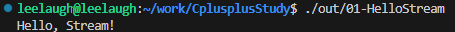

### 第一个程序
同所有编程语言的学习一样，第一个任务就是编写C++程序，使用GCC编译器将C++源码编译为机器码（可执行文件）。这里我们学习第一个C++的特性，输入输出流。
在C++中主要的流类型有：标准流对象、文件流、字符串流。
#### 标准流对象
什么是标准流？是直接与输入输出设备相关联的流对象，四种标准流对象是：
```
cin -标准输入流（有缓冲）
cout -标准输出流（有缓冲）
cerr -标准错误流（无缓冲）
clog -标准日志流（有缓冲）
```
在这里介绍一下缓冲机制。什么是缓冲？打个比方，我们写了一个这样的程序：
```
//C语言
#include <stdio.h>
int main(){
	int i, j;
	scanf("iIN=%d, jIN=%d", &i, &j);
	printf("iOUT=%d jOUT=%d\n",i ,j);
	return 0;
}
```
这是一个简单的C语言代码，在终端输入的数字被程序打印到终端中。在这里我们思考，我们的输入是如何被终端识别到作为`i`的值的？
肯定不是我刚输入这个数`i`这个值就变成了我输入的部分，一定是我触发了什么条件，我输入的字符串才被scanf识别到的。
是的，我按下了enter，按下enter之前，我的数据都存储在终端缓冲区，按下enter后，数据从终端缓冲区转移到了stdin缓冲区里面，等待被scanf等函数读取。不过scanf函数只会读取匹配的字符，不匹配的部分会被留在缓冲区（大部分时候会把`\n`留在缓冲区，因此需要用`getchar`清除缓冲区）。
这是C语言的缓冲机制，而C++的缓冲机制和C语言有些不同。我们在后续使用过程中再讲起。
现在编写我们的第一个C++程序，输出：`HelloWorld`
```
#include <iostream>

int main() {
    std::cout << "Hello, Stream!" << std::endl;
    return 0;
}
```

终端就可以看到输出了~